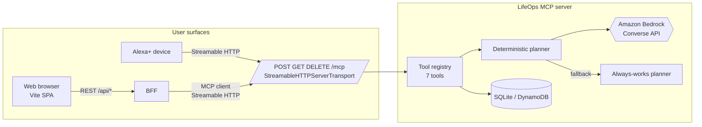
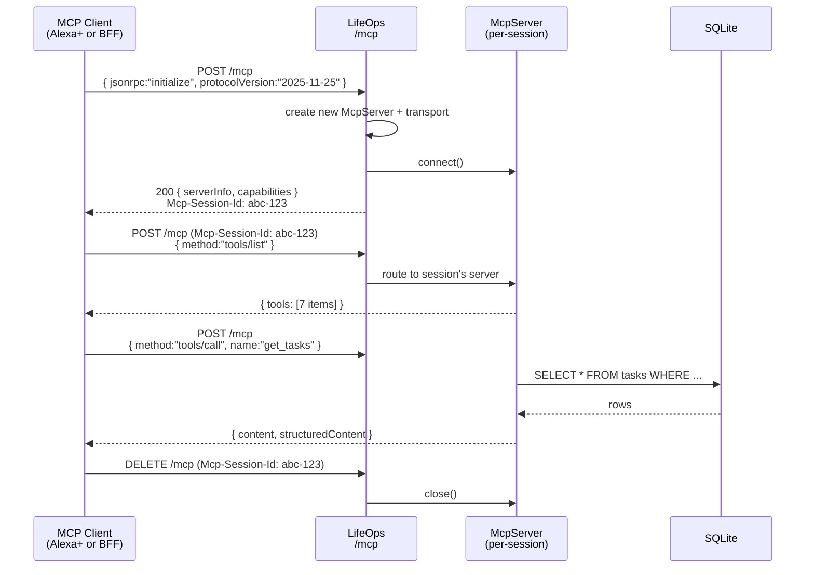
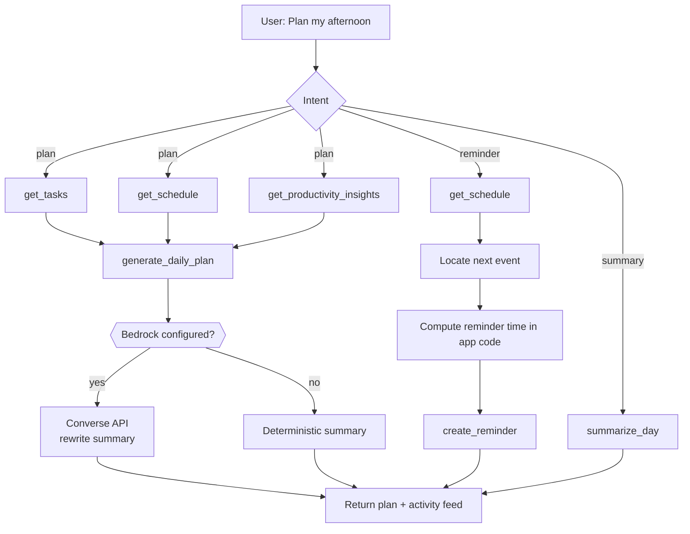
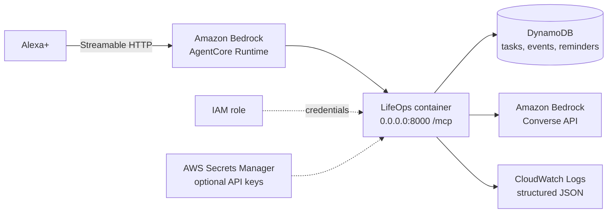
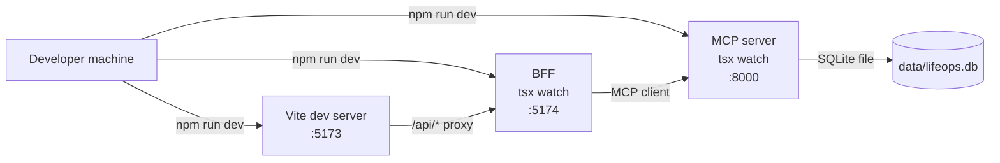

# Architecture

## System overview

LifeOps is a small distributed system with two live processes locally and a defined path to AWS deployment for the hackathon submission.

- **MCP server** — the star of the show. Speaks the Model Context Protocol over Streamable HTTP at `POST /mcp`. Exposes 7 tools. This is the endpoint that Alexa+ (and any other MCP client) connects to.
- **Web app** — a Vite/React SPA plus a small Express backend-for-frontend (BFF) that maintains an MCP client connection and exposes narrow REST endpoints to the SPA. This is the demo surface.

## Component diagram

## MCP architecture — session lifecycle

The Streamable HTTP transport is a single URL that handles POST (client → server), GET (server → client SSE stream), and DELETE (session termination). Each session gets its own `McpServer` + `StreamableHTTPServerTransport` instance to avoid CVE-2026-25536 (cross-client data leak when a transport is shared across sessions in SDK `<1.26.0`).

## Agentic workflow

The web BFF is a small deterministic orchestrator. It classifies intent and picks the tool sequence — this keeps the demo predictable and inspectable. Alexa+ replaces this with its own model-driven planner.

## Data flow

Every user request creates an activity log — an ordered list of `{tool, ok, ms, message}` records — that the UI displays. That's what the "Activity" pane shows. It is NOT the model's chain-of-thought; it's the actual tool orchestration.

## AWS architecture (target)

For local development, DynamoDB is replaced with SQLite via the same `DatabaseService` interface. Nothing in the tool layer changes.

## Security boundaries

- **CORS allowlist** — origins in `ALLOWED_ORIGINS`; browser flows can only start where you say.
- **Origin header enforcement** — the transport rejects mismatched Origins (mitigates DNS rebinding).
- **Optional API key** — `X-LifeOps-Api-Key` header. Documented as demo-only; Alexa+ deployments must use OAuth 2.0 (see `docs/alexa-plus.md`).
- **Secrets never in code** — env-driven; Secrets Manager for cloud; IAM role for AWS credentials.
- **Log redaction** — pino redacts `authorization`, `cookie`, `x-lifeops-api-key`, and any field named `accessKeyId`, `secretAccessKey`, `sessionToken`, `token`, `password`, `apiKey`.

## Local development architecture

## Production architecture (as documented; not deployed here)

The MCP server container is designed to run behind AgentCore Runtime. Environment configuration:

- `HOST=0.0.0.0`, `PORT=8000`, `MCP_PATH=/mcp` (AgentCore convention)
- IAM role provides Bedrock, DynamoDB, and CloudWatch permissions
- No long-lived AWS credentials; SDK reads from role

The web app can be hosted anywhere (S3+CloudFront, Amplify) — for the hackathon submission the video demo shows it running locally against the same MCP server that Alexa+ would use.
